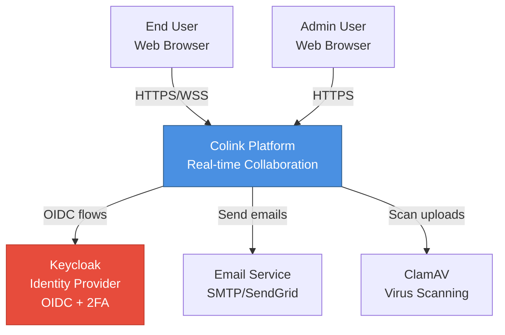
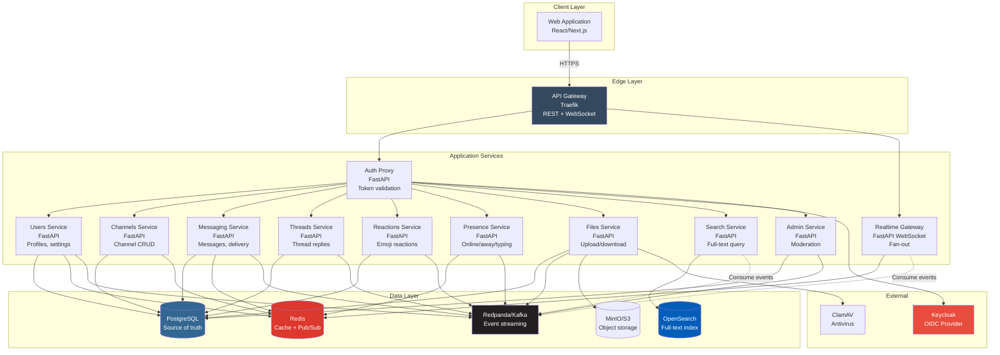

# System Architecture

## C4 Model - Context & Container Diagrams

This document describes the high-level architecture of Colink using the C4 model (Context and Container levels).

---

## Context Diagram (C4 Level 1)

The context diagram shows how Colink interacts with external systems and users.



### External Actors

| Actor | Description | Protocols |
|-------|-------------|-----------|
| **End User** | Regular platform user accessing via web browser | HTTPS, WebSocket (WSS) |
| **Admin User** | Administrator performing moderation and user management | HTTPS |
| **Keycloak** | External identity provider handling authentication and 2FA | OIDC, OAuth 2.0 |
| **Email Service** | Third-party SMTP service for notifications (optional) | SMTP |
| **ClamAV** | Antivirus engine for scanning uploaded files | HTTP (REST wrapper) |

---

## Container Diagram (C4 Level 2)

The container diagram shows the major containers (applications, services, data stores) and their interactions.



---

## Container Descriptions

### Edge Layer

#### API Gateway (Traefik)
- **Technology**: Traefik 3.x
- **Responsibilities**:
  - TLS termination (HTTPS)
  - Request routing to backend services
  - WebSocket upgrade handling
  - Rate limiting (IP-based and user-based)
  - CORS policy enforcement
  - Access logging
- **Ports**: 80 (HTTP), 443 (HTTPS)
- **Scaling**: Active-active load balancer

---

### Application Services

All application services are built with:
- **Runtime**: Python 3.12
- **Framework**: FastAPI
- **ASGI Server**: Uvicorn
- **Scaling**: Stateless, horizontal scaling

#### 1. Auth Proxy
- **Port**: 8001
- **Responsibilities**:
  - Keycloak integration (login, 2FA, logout, token refresh)
  - JWT validation (fetch and cache JWKS)
  - Session management (refresh tokens)
- **Dependencies**: Keycloak, Postgres (sessions table), Redis (JWKS cache)
- **API**: `/auth/login`, `/auth/refresh`, `/auth/logout`, `/auth/introspect`

#### 2. Users Service
- **Port**: 8002
- **Responsibilities**:
  - User profile CRUD
  - User settings (notifications, theme, language)
  - Avatar upload (presigned URLs)
  - User search/directory
- **Dependencies**: Postgres (users, user_settings), Redis (user cache), Kafka (user.events)
- **API**: `/v1/users/*`

#### 3. Channels Service
- **Port**: 8003
- **Responsibilities**:
  - Channel creation, update, archival
  - Channel membership management
  - Public/private channel access control
- **Dependencies**: Postgres (channels, channel_members), Redis (channel cache), Kafka (channel.events)
- **API**: `/v1/channels/*`

#### 4. Messaging Service
- **Port**: 8004
- **Responsibilities**:
  - Send, edit, delete messages
  - Channel messages and direct messages (DMs)
  - Message delivery tracking
  - Pagination and filtering
- **Dependencies**: Postgres (messages), Redis (unread counts), Kafka (message.events)
- **API**: `/v1/messages/*`

#### 5. Threads Service
- **Port**: 8005
- **Responsibilities**:
  - Create threads on messages
  - Add replies to threads
  - Thread metadata (reply count, last reply timestamp)
- **Dependencies**: Postgres (threads, messages), Kafka (thread.events)
- **API**: `/v1/threads/*`

#### 6. Reactions Service
- **Port**: 8006
- **Responsibilities**:
  - Add/remove emoji reactions to messages
  - Aggregate reaction counts
- **Dependencies**: Postgres (reactions), Redis (reaction cache), Kafka (reaction.events)
- **API**: `/v1/messages/{id}/reactions`

#### 7. Presence Service
- **Port**: 8007
- **Responsibilities**:
  - User online/away/DND status
  - Typing indicators (per channel)
  - Heartbeat tracking
- **Dependencies**: Redis (ephemeral state with TTL), Kafka (presence.events)
- **API**: `/v1/presence/*`

#### 8. Files Service
- **Port**: 8008
- **Responsibilities**:
  - Presigned upload/download URLs (MinIO/S3)
  - File metadata management
  - Virus scan orchestration (ClamAV)
  - Thumbnail generation (async)
- **Dependencies**: Postgres (files), MinIO, ClamAV, Kafka (file.events)
- **API**: `/v1/files/*`

#### 9. Search Service
- **Port**: 8009
- **Responsibilities**:
  - Full-text search (messages, files, users)
  - Index management
  - Query with filters and highlighting
- **Dependencies**: OpenSearch, Kafka (consumes all events for indexing)
- **API**: `/v1/search/*`

#### 10. Admin Service
- **Port**: 8010
- **Responsibilities**:
  - User deactivation/reactivation
  - Message moderation (delete, flag)
  - Audit log queries
- **Dependencies**: Postgres (audit_logs), Kafka (audit.events)
- **API**: `/v1/admin/*`
- **Authorization**: Requires `admin` or `moderator` role

#### 11. Realtime Gateway
- **Port**: 8011
- **Protocol**: WebSocket
- **Responsibilities**:
  - Persistent WebSocket connections
  - Real-time event fan-out (messages, reactions, presence, typing)
  - Subscription management (channels, DMs)
  - Heartbeat/ping-pong
- **Dependencies**: Redis (pub/sub, connection mapping), Kafka (event consumption)
- **Endpoint**: `WS /ws`

---

### Data Layer

#### PostgreSQL 16
- **Purpose**: Primary data store (source of truth)
- **Stores**:
  - Users, channels, messages, threads, reactions
  - Files metadata, audit logs, sessions
- **Configuration**:
  - Replication: Read replicas for scaling
  - Connection pooling: PgBouncer
  - Backups: Daily snapshots + WAL archiving
- **Port**: 5432

#### Redis 7
- **Purpose**: Cache and ephemeral state
- **Use Cases**:
  - User/channel cache (5-minute TTL)
  - Presence status (60-second TTL)
  - Typing indicators (5-second TTL)
  - Rate limiting counters
  - WebSocket connection mapping
  - Pub/Sub for real-time fan-out
- **Port**: 6379

#### Redpanda (Kafka-compatible)
- **Purpose**: Event streaming and async messaging
- **Topics**: `user.events`, `channel.events`, `message.events`, `thread.events`, `reaction.events`, `presence.events`, `file.events`, `audit.events`
- **Configuration**:
  - Partitions: 3-12 per topic (based on throughput)
  - Retention: 1-90 days (based on topic)
  - Replication factor: 3 (production)
- **Port**: 9092

#### MinIO (S3-compatible)
- **Purpose**: Object storage
- **Buckets**:
  - `colink-files`: File attachments
  - `colink-avatars`: User avatars
  - `colink-thumbnails`: Image thumbnails
- **Configuration**:
  - Presigned URLs (5-minute TTL for upload, 1-hour for download)
  - Lifecycle policies (delete infected files after 30 days)
- **Ports**: 9000 (API), 9001 (Console)

#### OpenSearch 2.x
- **Purpose**: Full-text search engine
- **Indices**: `messages`, `files`, `users`
- **Configuration**:
  - Shards: 3 per index
  - Replicas: 1
  - Refresh interval: 5s
- **Port**: 9200

---

### External Systems

#### Keycloak 23.x
- **Purpose**: Identity and access management
- **Features**:
  - OIDC/OAuth 2.0 flows
  - 2FA (TOTP, WebAuthn)
  - User federation (LDAP/AD)
  - Admin console
- **Configuration**:
  - Realm: `colink`
  - Clients: `web-app`, `api-gateway`, `service-internal`
- **Port**: 8080

#### ClamAV
- **Purpose**: Antivirus scanning
- **Integration**: REST wrapper around `clamdscan`
- **Flow**:
  1. Files service uploads to MinIO
  2. Calls ClamAV scan endpoint
  3. Updates file status (scanned/infected)
- **Port**: 3310 (custom REST wrapper)

---

## Communication Patterns

### Synchronous (HTTP/REST)
- **Client → Gateway → Service**: All user-initiated requests
- **Service → Service**: Internal calls (e.g., threads service → messaging service)
- **Pattern**: Request/response, blocking
- **Timeout**: 10s for external calls, 30s for search

### Asynchronous (Kafka)
- **Service → Kafka → Service**: Event-driven updates
- **Examples**:
  - `message.created` → Search service indexes
  - `user.deactivated` → Messaging service redacts messages
- **Pattern**: Fire-and-forget, eventual consistency
- **Consumer**: At-least-once delivery with idempotent processing

### Real-Time (WebSocket)
- **Client → Realtime Gateway**: Persistent bidirectional connection
- **Pattern**: Pub/Sub via Redis, fan-out to connected clients
- **Heartbeat**: 30s ping/pong

### Object Storage (Presigned URLs)
- **Client → MinIO**: Direct upload/download (bypasses app servers)
- **Pattern**: Files service generates presigned URLs (5-min TTL)
- **Security**: Pre-authenticated, time-limited access

---

## Deployment Topology

### Development (Docker Compose)
```
┌─────────────────────────────────────────┐
│  Docker Host (localhost)                │
│                                         │
│  ┌──────────┐  ┌──────────┐             │
│  │ Traefik  │  │ Keycloak │             │
│  └──────────┘  └──────────┘             │
│                                         │
│  ┌──────────────────────────────────┐   │
│  │ Application Services (11 ctrs)   │   │
│  └──────────────────────────────────┘   │
│                                         │
│  ┌──────────┐  ┌──────────┐             │
│  │ Postgres │  │  Redis   │             │
│  └──────────┘  └──────────┘             │
│                                         │
│  ┌──────────┐  ┌──────────┐             │
│  │ Redpanda │  │  MinIO   │             │
│  └──────────┘  └──────────┘             │
│                                         │
│  ┌──────────┐  ┌──────────┐             │
│  │OpenSearch│  │  ClamAV  │             │
│  └──────────┘  └──────────┘             │
└─────────────────────────────────────────┘
```

### Production (Kubernetes - Optional)
```
┌─────────────────────────────────────────┐
│  Kubernetes Cluster                     │
│                                         │
│  ┌──────────────────────────────────┐   │
│  │ Ingress (Traefik/NGINX)          │   │
│  └──────────────────────────────────┘   │
│                                         │
│  ┌──────────────────────────────────┐   │
│  │ Service Pods (auto-scaled)       │   │
│  │ - auth-proxy (3 replicas)        │   │
│  │ - users-service (3 replicas)     │   │
│  │ - messaging-service (5 replicas) │   │
│  │ - realtime-gateway (5 replicas)  │   │
│  │ - ... (other services)           │   │
│  └──────────────────────────────────┘   │
│                                         │
│  ┌──────────────────────────────────┐   │
│  │ Managed Services                 │   │
│  │ - RDS Postgres (multi-AZ)        │   │
│  │ - ElastiCache Redis (cluster)    │   │
│  │ - MSK Kafka (managed Kafka)      │   │
│  │ - S3 (object storage)            │   │
│  │ - OpenSearch Service             │   │
│  └──────────────────────────────────┘   │
└─────────────────────────────────────────┘
```

---

## High Availability & Fault Tolerance

### Service Redundancy
- **Minimum**: 2 replicas per service (production)
- **Load balancing**: Round-robin via Traefik/Kubernetes Service
- **Health checks**: `/health` (liveness), `/ready` (readiness)

### Database Resilience
- **Postgres**: Primary + read replicas (async replication)
- **Redis**: Redis Sentinel (auto-failover) or Redis Cluster
- **Kafka**: Replication factor 3 (can tolerate 2 broker failures)

### Graceful Degradation
| Failure | Impact | Mitigation |
|---------|--------|------------|
| Postgres down | No writes | Serve cached data (read-only mode), queue writes in Kafka |
| Redis down | Slower reads, no presence | Direct DB queries, disable presence UI |
| Kafka down | No async events | Buffer events in Redis list, replay on recovery |
| OpenSearch down | No search | Return 503, show recent messages from DB |
| MinIO down | No file upload | Queue uploads, retry mechanism |

---

## Security Boundaries

### Network Segmentation
```
Internet
   │
   ▼
[Traefik (TLS termination)]
   │
   ▼
[Application Services] ← JWT validation
   │
   ├─→ [Postgres] (internal network)
   ├─→ [Redis] (internal network)
   ├─→ [Kafka] (internal network)
   ├─→ [MinIO] (internal network)
   └─→ [OpenSearch] (internal network)
```

### Authentication Flow
1. Client → Keycloak (login + 2FA)
2. Keycloak → Client (access_token + refresh_token)
3. Client → Traefik (Authorization: Bearer {token})
4. Traefik → Service (forward token)
5. Service → Validate JWT (JWKS from Keycloak)

### Authorization
- **Role-based**: `admin`, `moderator`, `member`, `guest`
- **Resource-based**: Channel membership, message ownership
- **Enforced at**: Service layer (not gateway)

---

## Next Steps

1. **Review Data Flows**: [02-data-flows.md](./02-data-flows.md)
2. **Explore Service Contracts**: [05-service-inventory.md](./05-service-inventory.md)
3. **Study Security Model**: [03-security-model.md](./03-security-model.md)
