# Core Data Flows

This document describes the detailed sequence diagrams for key user journeys in Colink.

---

## 1. User Sign-In with 2FA

**Key Points**:
- 2FA is mandatory (enforced by Keycloak authentication flow)
- Challenge session stored in Keycloak (stateless for auth-proxy)
- Tokens cached in Redis (1-hour TTL for JWKS)
- Audit event published to Kafka

---

## 2. Send Direct Message (DM)

**Key Points**:
- Idempotency key prevents duplicate sends (network retries)
- Kafka event ensures eventual consistency (search index updated async)
- Redis pub/sub provides low-latency real-time delivery
- WebSocket connection mapping stored in Redis

---

## 3. Create Channel & Post Message

**Key Points**:
- Channel creation is atomic (channel + membership in single transaction)
- Channel messages require membership check before insert
- Fan-out logic: Realtime gateway fetches all channel members, sends to each WebSocket connection
- Offline members see message on next login (query `/v1/messages?channelId=...`)

---

## 4. Upload File & Attach to Message

**Key Points**:
- Presigned URL offloads upload traffic from application servers
- Two-step upload: (1) presigned URL, (2) confirm after upload
- Virus scanning is asynchronous (callback from ClamAV)
- Files can only be attached by uploader and after scan completes

---

## 5. Search Messages

**Key Points**:
- Search respects channel membership (user can only search channels they're in)
- Deleted messages excluded via OpenSearch filter + Postgres double-check
- Highlights show matched terms in context (`<em>` tags)
- Eventual consistency: newly created messages may take 5-10s to appear in search

---

## 6. Presence Update & Typing Indicators

### Presence Update

### Typing Indicator

**Key Points**:
- Presence stored in Redis with TTL (60s for status, 5s for typing)
- Client must heartbeat to maintain "online" status
- Typing indicators are ephemeral (auto-expire if no activity)
- Events fan out only to relevant users (same channels)

---

## 7. React with Emoji

```mermaid
sequenceDiagram
    participant U as User
    participant Re as Reactions Service
    participant P as Postgres
    participant K as Kafka
    participant R as Redis
    participant RT as Realtime Gateway
    participant U2 as Viewers

    U->>Re: POST /v1/messages/{messageId}/reactions<br/>{emoji: "👍", idempotencyKey}
    Re->>Re: Validate JWT<br/>Validate emoji format
    Re->>P: INSERT INTO reactions<br/>(message_id, user_id, emoji)<br/>ON CONFLICT (message_id, user_id, emoji) DO NOTHING
    alt Already reacted
        Re-->>U: 409 Conflict
    end
    Re->>K: Publish reaction.added event<br/>(key=message_id, idempotent)
    Re->>R: INCR message:{message_id}:reactions:{emoji}
    Re->>R: SET idempotency:{key} (24h TTL)
    Re-->>U: 201 + reaction object

    RT->>K: Consume reaction.added event
    RT->>RT: Determine message viewers<br/>(channel members or DM participants)
    RT->>U2: WebSocket SEND<br/>{type: reaction.added, messageId, userId, emoji}
```

**Key Points**:
- Duplicate reactions prevented by unique constraint (message_id, user_id, emoji)
- Redis counter caches reaction counts (invalidated on removal)
- Real-time updates show reactions immediately to all viewers

---

## 8. Threaded Reply

**Key Points**:
- Thread created atomically with first reply
- Subsequent replies increment `reply_count`
- Thread ID links replies to parent message
- Real-time updates notify thread subscribers

---

## 9. Admin Moderation (Delete Message)

**Key Points**:
- Soft delete (message not physically removed, just flagged)
- Audit log records who performed moderation and why
- Search index updated to exclude deleted message
- Real-time gateway can push deletion event to connected clients (optional)

---

## Data Flow Summary

| Journey | Services Involved | Data Stores | Events Published |
|---------|------------------|-------------|------------------|
| **Sign-In with 2FA** | Auth Proxy, Keycloak | Postgres (sessions) | `user.logged_in` |
| **Send DM** | Messaging | Postgres, Redis, Kafka | `message.created` |
| **Create Channel** | Channels | Postgres, Kafka | `channel.created` |
| **Post Message** | Messaging | Postgres, Redis, Kafka | `message.created` |
| **Upload File** | Files, ClamAV | Postgres, MinIO, Kafka | `file.uploaded`, `file.scanned` |
| **Search Messages** | Search | OpenSearch, Postgres | - (consumer only) |
| **Update Presence** | Presence | Redis, Kafka | `presence.updated` |
| **Typing Indicator** | Presence | Redis, Kafka | `typing.started` |
| **React with Emoji** | Reactions | Postgres, Redis, Kafka | `reaction.added` |
| **Threaded Reply** | Threads, Messaging | Postgres, Kafka | `thread.created`, `reply.created` |
| **Admin Moderate** | Admin, Messaging | Postgres, Kafka | `message.moderated` |

---

## Next Steps

1. **Review Service Contracts**: [05-service-inventory.md](./05-service-inventory.md)
2. **Study Security Model**: [03-security-model.md](./03-security-model.md)
3. **Explore API Specs**: [../api-specs/](../api-specs/)
