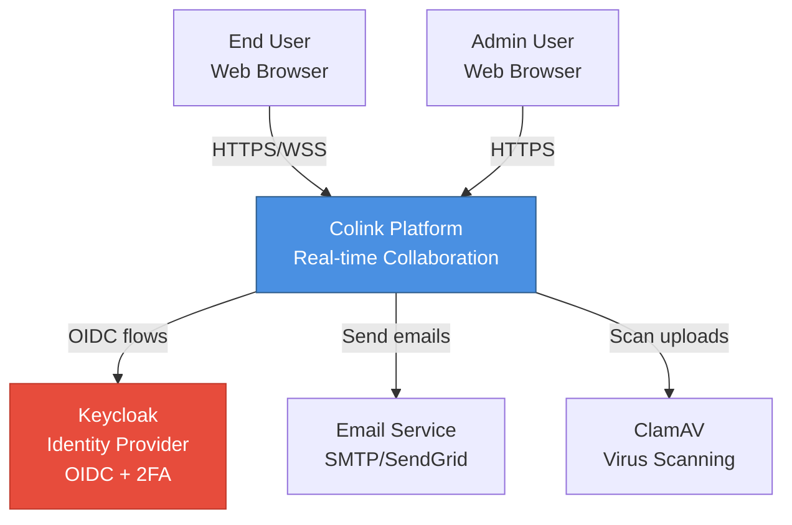

# C4 Context Diagram

## System Context (Level 1)

This diagram shows the Colink platform in its environment, showing the actors and external systems that interact with it.



## Actors

### End User
- **Role**: Regular platform user
- **Access**: Web browser (desktop/mobile)
- **Capabilities**:
  - Sign in with username/password + 2FA
  - Send/receive real-time messages
  - Create and join channels
  - Upload/download files
  - Search messages and files
  - React to messages with emojis
  - Participate in threaded conversations

### Admin User
- **Role**: Platform administrator
- **Access**: Web browser with elevated privileges
- **Capabilities**:
  - All end-user capabilities
  - Deactivate/reactivate users
  - Moderate messages (delete, flag)
  - Access audit logs
  - Manage system-wide settings

## External Systems

### Keycloak (Identity Provider)
- **Protocol**: OIDC (OpenID Connect) / OAuth 2.0
- **Purpose**: User authentication and authorization
- **Integration**:
  - Authorization Code flow with PKCE for web app
  - 2FA enforcement (TOTP, WebAuthn)
  - JWT token issuance (access + refresh tokens)
  - User federation (future: LDAP/AD integration)

**Endpoints Used**:
```
POST /realms/colink/protocol/openid-connect/token
GET  /realms/colink/protocol/openid-connect/certs (JWKS)
POST /realms/colink/protocol/openid-connect/logout
POST /realms/colink/protocol/openid-connect/token/introspect
```

### Email Service (Optional)
- **Protocol**: SMTP / REST API (SendGrid, Mailgun)
- **Purpose**: Transactional emails
- **Use Cases**:
  - Password reset emails
  - New message notifications (configurable)
  - Admin alerts
  - Weekly digest (future)

**Note**: Email is optional for MVP; can be disabled via environment variable.

### ClamAV (Antivirus)
- **Protocol**: HTTP (REST wrapper around ClamAV daemon)
- **Purpose**: Virus scanning for uploaded files
- **Integration**:
  - Files service sends scan request after upload
  - ClamAV scans file and calls back with result
  - Infected files quarantined (status = 'infected')

**Endpoints Used**:
```
POST /scan (request scan)
POST /callback (scan result notification)
```

## Communication Protocols

| Connection | Protocol | Port | TLS | Description |
|-----------|----------|------|-----|-------------|
| User → System | HTTPS | 443 | Yes | All API requests |
| User → System | WSS | 443 | Yes | WebSocket (real-time events) |
| System → Keycloak | HTTPS | 443 | Yes | OIDC token flows |
| System → Email | SMTP/HTTPS | 587/443 | Yes | Send emails |
| System → ClamAV | HTTP | 3310 | No | Internal network, no TLS needed |

## Trust Boundaries

```
┌─────────────────────────────────────────┐
│  Public Internet (Untrusted)            │
│                                         │
│  ┌──────────────────┐                   │
│  │  End Users       │                   │
│  │  Admins          │                   │
│  └──────────────────┘                   │
└──────────────┬──────────────────────────┘
               │ HTTPS/TLS 1.3
┌──────────────▼──────────────────────────┐
│  DMZ / Edge Layer                       │
│                                         │
│  ┌──────────────────┐                   │
│  │  Traefik Gateway │                   │
│  │  (TLS Term)      │                   │
│  └──────────────────┘                   │
└──────────────┬──────────────────────────┘
               │ HTTP (internal)
┌──────────────▼──────────────────────────┐
│  Application Layer (Trusted)            │
│                                         │
│  ┌──────────────────┐                   │
│  │  Microservices   │                   │
│  │  (11 services)   │                   │
│  └──────────────────┘                   │
│                                         │
│  ┌──────────────────┐                   │
│  │  Data Stores     │                   │
│  │  (Postgres, etc) │                   │
│  └──────────────────┘                   │
└─────────────────────────────────────────┘
```

## Security Posture

### Authentication
- All users authenticate via Keycloak
- 2FA mandatory (TOTP or WebAuthn)
- JWT tokens (1-hour access, 30-day refresh)
- Tokens validated on every API request

### Authorization
- Role-based access control (RBAC)
- Roles: admin, moderator, member, guest
- Resource ownership checks (e.g., edit own messages)

### Data Protection
- TLS 1.3 for all external communication
- Passwords hashed by Keycloak (bcrypt)
- Refresh tokens hashed in database (SHA-256)
- File virus scanning before delivery

## Scalability

- **Horizontal scaling**: All application services are stateless
- **Load balancing**: Traefik distributes requests round-robin
- **Database**: Postgres with read replicas (future)
- **Caching**: Redis for hot data (users, channels, presence)
- **Storage**: S3-compatible object storage (MinIO) for files

---

**Related Diagrams**:
- [Container Diagram](./c4-container.md) - Internal architecture
- [ERD](./erd.md) - Database schema relationships
